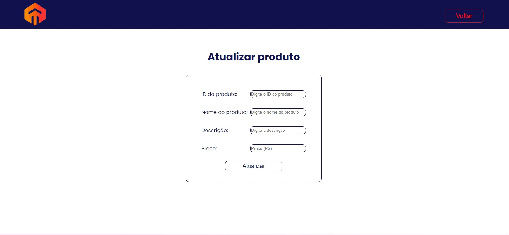

# Projeto S4 Suprimentos - CRUD Application

### Este projeto consiste em um Software de gestão de produtos, onde o usuário pode cadastrar e gerir produtos.

> O software está em português e o código fonte em inglês.

## Introdução:
O projeto foi desenvolvido utilizando o framework Flask com banco de dados MySQL, o banco foi criado utilizando Docker. Nesta documentação será abordado tanto a criação do software quanto como utilizá-lo.

## Requisitos:
Para poder rodar o programa em seu computador devemos ter algumas bibliotecas Python instaladas. Para instalar as bibliotecas necessárias, deve rodar o comando:
```bash
$ git clone https://github.com/JotahIvo/CRM-S4Suprimentos.git
$ cd ProjetoS4Suprimentos
$ pip install -r requirements.txt
```
Para o banco de dados, devemos instalar o docker, no meu caso instalei para WSL seguindo a [Documentação do Docker][link-docker]

Além do Docker, também instalei o [DBeaver][link-dbeaver] para poder visualizar o banco de dados.

### Rodando o projeto na sua máquina:
Após ter clonado o repositório, instalado as bibliotecas do `requirements.txt` e o Docker, você deve iniciar um banco de dados MySQL com o Docker com os seguintes comandos:

```bash
$ docker pull mysql/mysql-server:latest
$ docker run -d -p 3306:3306 --name mysql-docker-container -e MYSQL_ROOT_PASSWORD=admin -e MYSQL_DATABASE=photo_app -e MYSQL_USER=admin -e MYSQL_PASSWORD=admin mysql/mysql-server:latest
```

Dessa forma o container já está funcionando e rodando um banco de dados MySQL.

Em seguida, basta rodar o comando:

```bash
$ python main.py
```

Dessa forma, o projeto irá rodar e se encontrar disponível no seu localhost:5000, para acessar, basta digitar no seu navegador: http://127.0.0.1:5000 e você terá acesso ao projeto.

## Etapas de desenvolvimento:

### 1° Etapa: Planejamento do Software
O planejamento foi essencial para que o software fosse desenvolvido da melhor forma possível, mais organizada, no tempo certo e que cumprisse com todos os requisitos propostos. 

### 2° Etapa: Login e Autenticação
Nesta primeira fase, o foco foi na criação de uma página de login e as páginas de usuários (os usuários e como cada um funciona será explicado mais a frente).

Como só temos dois tipos de usuários, foi criado um arquivo `users.json` para armazenar os usuários e suas senhas.

Para autenticar, foi criado um arquivo `login_autentication.py` que é chamado na `main.py` e é responssável por autenticar e validar o login do usuário.

### 3° Etapa: Criação do Banco MySQL em um Docker Container
Para a criação do banco, foi escolhido o Docker, pois ele oferece algumas vantagens:
> Isolamento e portabilidade;

> Facilidade de configuração e reprodução do ambiente;

> Gerenciamento eficiente de recursos;

> Facilidade na integração com outras tecnologias.

Após a instalação do Docker, foi criado o banco com o nome `photo_app`, que é o nome padrão do banco.

O DBeaver foi utilizado para testar conexão com o banco e ter uma melhor visualização das tabelas.

### 4° Etapa: Criando as funções de CRUD com SQLAlchemy

No arquivo `models.py`, foi criado a classe "Products", esta é a classe que será utilizada para criar a tabela dentro do banco seguindo as especificações do projeto.

Já no arquivo `database.py` é onde foi criado as funções que fazem o CRUD no banco de dados. Aqui nós fazemos as conexões com o banco de dados, criamos a tabela "tb_products", caso ela ainda não tenha sido criada e também as funções de Insert, Delete, Update e Select (o select neste caso é de todos os produtos).

### 5° Etapa: CRUD no Banco de Dados

No nosso arquivo de rotas `routes.py`, foi criado as rotas que iram chamar as funções de CRUD que foram implementadas na etapa anterior. 

> Insert: Pega os dados do formulário (nome, descrição e preço) e insere na tabela.

> Update: Aqui é criado outro formulário e seus dados são pegos (id, nome, descição e preço) e é feito o update desses dados na tabela.

> Delete: Há um botão com o ícone de uma lixeira, ao apertar o id desse produto é enviado para a função de delete e o item é deletado do banco de dados.

> Select: O select é feito para todos os itens da tabela e exibido no front, tanto para a página de administrador, quanto para a página de usuário.


### 6° Etapa: Refatoração e Documentação

Esta é a última etapa do projeto, após tudo estar funcionando da maneira esperada, o código é reescrito de forma mais organizada e com mais fácil compreensão, para que seja mais fácil a leitura e a atualização do software.

A documentação acontece ao final da refatoração, que consiste em um arquivo `README.md` que contém tudo sobre a utilização do software, tanto para desenvolvedores quanto para usuários comuns. Nela é abordado, instalação e como rodar o software em sua máquina, etapas de desenvolvimento e por fim um guia de como usar e navegar pelo software.

## Guia de navegação:

### Login: 
Na tela de login, você terá os campos: usuário e senha. 
> Aministrador: o administrador tem acesso a lista de produtos e ao CRUD. Para poder acessar como aministrador, basta preencher, usuário: admin e senha: admin123.

> Usuário: o usuário tem acesso apenas a lista de produtos. Para acessar como usuário, basta preencher, usuário: user e senha: user123


Imagem 1: Página de Login

### Páginas de usuário e administrador 
Na página de usuário temos a lista de produtos cadastrados no banco de dados.


Imagem 2: Página de usuário

Na página de adminstrador temos além da lista de produtos cadastrados, temos também três botões: "Novo Produto +" para cadastrar um novo produto, "Atualizar Produto" para atualizar as informações de um produto e o botão da lixeira que apaga um produto do banco de dados.


Imagem 3: Página de administrador

### Páginas de Novo Produto e Atualizar Produto
Na página de "Novo Produto +" temos um formulário que é possível cadastrar um novo produto.


Imagem 4: Página de cadastro de produtos

Na página de "Atualizar Produto" temos um formulário que é possível atualizar um produto já cadastrado.


Imagem 5: Página de atualizar produtos

Criado por João Pedro de Almeida Ivo.

[link-docker]: https://docs.docker.com/desktop/wsl/
[link-dbeaver]: https://dbeaver.io/download/